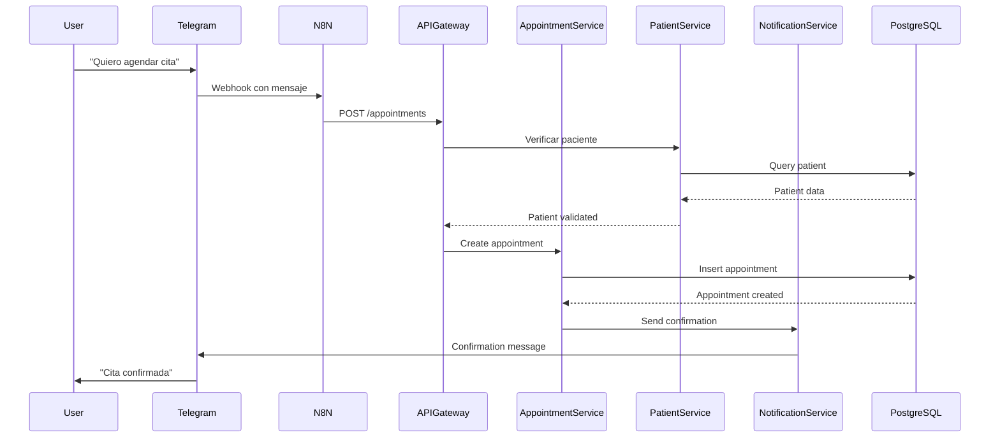

# 📐 Documento de Diseño del Sistema

## 1. Visión General

El Sistema de Gestión de Citas Médicas es una aplicación basada en microservicios que demuestra la aplicación práctica de principios SOLID, patrones de diseño y mejores prácticas de ingeniería de software.

## 2. Arquitectura de Microservicios

### 2.1 Justificación de la Arquitectura

La arquitectura de microservicios fue elegida para:
- **Separación de responsabilidades**: Cada servicio maneja un dominio específico
- **Escalabilidad independiente**: Los servicios pueden escalar según demanda
- **Desarrollo paralelo**: Equipos pueden trabajar independientemente
- **Resiliencia**: Fallos aislados no afectan todo el sistema
- **Demostración educativa**: Perfecta para enseñar principios SOLID

### 2.2 Servicios del Sistema

```yaml
Servicios:
  1. API Gateway:
     - Responsabilidad: Punto de entrada único
     - Puerto: 3000
     - Patrón: API Gateway Pattern
  
  2. Appointment Service:
     - Responsabilidad: Gestión de citas
     - Puerto: 3001
     - Dominio: Citas médicas
  
  3. Patient Service:
     - Responsabilidad: Gestión de pacientes
     - Puerto: 3002
     - Dominio: Información de pacientes
  
  4. Notification Service:
     - Responsabilidad: Envío de notificaciones
     - Puerto: 3003
     - Dominio: Comunicaciones
  
  5. N8N:
     - Responsabilidad: Orquestación de flujos
     - Puerto: 5678
     - Patrón: Orchestration Pattern
```

## 3. Principios SOLID Aplicados

### 3.1 Single Responsibility Principle (SRP)

**Definición**: Una clase debe tener una sola razón para cambiar.

**Implementación en el Sistema**:

```python
# ❌ VIOLACIÓN de SRP - Clase con múltiples responsabilidades
class AppointmentManager:
    def create_appointment(self, data):
        # Lógica de negocio
        pass
    
    def save_to_database(self, appointment):
        # Persistencia
        pass
    
    def send_notification(self, appointment):
        # Notificaciones
        pass
    
    def validate_doctor_availability(self, doctor_id):
        # Validación
        pass

# ✅ APLICANDO SRP - Responsabilidades separadas
class AppointmentService:
    """Solo maneja la lógica de negocio de citas"""
    def __init__(self, repository, validator):
        self.repository = repository
        self.validator = validator
    
    def create_appointment(self, data):
        if self.validator.is_valid(data):
            appointment = Appointment(**data)
            return self.repository.save(appointment)

class AppointmentRepository:
    """Solo maneja persistencia de citas"""
    def save(self, appointment):
        # Lógica de base de datos
        pass
    
    def find_by_id(self, id):
        pass

class AppointmentValidator:
    """Solo maneja validación de citas"""
    def is_valid(self, data):
        # Lógica de validación
        pass

class NotificationSender:
    """Solo maneja envío de notificaciones"""
    def send(self, notification):
        # Lógica de notificaciones
        pass
```

### 3.2 Open/Closed Principle (OCP)

**Definición**: Las entidades deben estar abiertas para extensión pero cerradas para modificación.

**Implementación en el Sistema**:

```python
# ✅ APLICANDO OCP - Usando abstracciones
from abc import ABC, abstractmethod

class NotificationChannel(ABC):
    """Abstracción para canales de notificación"""
    @abstractmethod
    def send(self, message, recipient):
        pass

class EmailNotification(NotificationChannel):
    """Implementación para email"""
    def send(self, message, recipient):
        # Enviar por email
        return f"Email sent to {recipient}"

class SMSNotification(NotificationChannel):
    """Implementación para SMS"""
    def send(self, message, recipient):
        # Enviar por SMS
        return f"SMS sent to {recipient}"

class TelegramNotification(NotificationChannel):
    """Nueva funcionalidad sin modificar código existente"""
    def send(self, message, recipient):
        # Enviar por Telegram
        return f"Telegram message sent to {recipient}"

class NotificationService:
    """Servicio que usa las abstracciones"""
    def __init__(self):
        self.channels = {}
    
    def register_channel(self, name, channel: NotificationChannel):
        """Permite añadir nuevos canales sin modificar la clase"""
        self.channels[name] = channel
    
    def notify(self, channel_name, message, recipient):
        if channel_name in self.channels:
            return self.channels[channel_name].send(message, recipient)
```

### 3.3 Liskov Substitution Principle (LSP)

**Definición**: Los objetos de una subclase deben poder reemplazar objetos de la superclase sin alterar el funcionamiento.

**Implementación en el Sistema**:

```python
# ✅ APLICANDO LSP - Substitución correcta
class Repository(ABC):
    """Contrato base para todos los repositorios"""
    @abstractmethod
    def save(self, entity):
        """Debe retornar la entidad guardada"""
        pass
    
    @abstractmethod
    def find_by_id(self, id):
        """Debe retornar la entidad o None"""
        pass
    
    @abstractmethod
    def delete(self, id):
        """Debe retornar True si se eliminó"""
        pass

class PostgreSQLRepository(Repository):
    """Implementación para PostgreSQL"""
    def save(self, entity):
        # Guardar en PostgreSQL
        return entity  # Cumple el contrato
    
    def find_by_id(self, id):
        # Buscar en PostgreSQL
        return entity or None  # Cumple el contrato
    
    def delete(self, id):
        # Eliminar de PostgreSQL
        return True  # Cumple el contrato

class MongoDBRepository(Repository):
    """Implementación para MongoDB - intercambiable"""
    def save(self, entity):
        # Guardar en MongoDB
        return entity  # Mismo comportamiento
    
    def find_by_id(self, id):
        # Buscar en MongoDB
        return entity or None  # Mismo comportamiento
    
    def delete(self, id):
        # Eliminar de MongoDB
        return True  # Mismo comportamiento

# Uso intercambiable
def process_appointment(repository: Repository, appointment):
    """Funciona con cualquier implementación de Repository"""
    saved = repository.save(appointment)
    found = repository.find_by_id(saved.id)
    assert found is not None  # Siempre funciona
```

### 3.4 Interface Segregation Principle (ISP)

**Definición**: Los clientes no deberían verse forzados a depender de interfaces que no usan.

**Implementación en el Sistema**:

```python
# ❌ VIOLACIÓN de ISP - Interface muy grande
class IUserService(ABC):
    @abstractmethod
    def create_user(self): pass
    
    @abstractmethod
    def update_user(self): pass
    
    @abstractmethod
    def delete_user(self): pass
    
    @abstractmethod
    def authenticate(self): pass
    
    @abstractmethod
    def reset_password(self): pass
    
    @abstractmethod
    def send_notification(self): pass
    
    @abstractmethod
    def generate_report(self): pass

# ✅ APLICANDO ISP - Interfaces segregadas
class IUserCRUD(ABC):
    """Interface para operaciones CRUD"""
    @abstractmethod
    def create_user(self, data): pass
    
    @abstractmethod
    def update_user(self, id, data): pass
    
    @abstractmethod
    def delete_user(self, id): pass

class IAuthenticable(ABC):
    """Interface para autenticación"""
    @abstractmethod
    def authenticate(self, credentials): pass
    
    @abstractmethod
    def reset_password(self, email): pass

class INotifiable(ABC):
    """Interface para notificaciones"""
    @abstractmethod
    def send_notification(self, message): pass

# Implementaciones específicas
class PatientService(IUserCRUD):
    """Solo implementa lo que necesita"""
    def create_user(self, data):
        return Patient(**data)
    
    def update_user(self, id, data):
        # Actualizar paciente
        pass
    
    def delete_user(self, id):
        # Eliminar paciente
        pass

class AuthService(IAuthenticable):
    """Solo implementa autenticación"""
    def authenticate(self, credentials):
        # Lógica de autenticación
        pass
    
    def reset_password(self, email):
        # Lógica de reset
        pass
```

### 3.5 Dependency Inversion Principle (DIP)

**Definición**: Depender de abstracciones, no de concreciones.

**Implementación en el Sistema**:

```python
# ✅ APLICANDO DIP - Inversión de dependencias
from typing import Protocol

class IAppointmentRepository(Protocol):
    """Abstracción del repositorio"""
    def save(self, appointment): ...
    def find_by_id(self, id): ...
    def find_by_patient(self, patient_id): ...

class INotificationService(Protocol):
    """Abstracción del servicio de notificaciones"""
    def send(self, recipient, message): ...

class AppointmentUseCase:
    """Caso de uso que depende de abstracciones"""
    def __init__(
        self,
        repository: IAppointmentRepository,  # Abstracción
        notifier: INotificationService       # Abstracción
    ):
        self.repository = repository
        self.notifier = notifier
    
    def create_appointment(self, patient_id, doctor_id, date):
        # Lógica de negocio
        appointment = Appointment(
            patient_id=patient_id,
            doctor_id=doctor_id,
            date=date
        )
        
        # Usar abstracciones
        saved = self.repository.save(appointment)
        
        message = f"Cita confirmada para {date}"
        self.notifier.send(patient_id, message)
        
        return saved

# Inyección de dependencias en el punto de entrada
def create_appointment_service():
    """Factory que inyecta las dependencias concretas"""
    repository = PostgreSQLAppointmentRepository()  # Concreción
    notifier = TelegramNotificationService()        # Concreción
    
    return AppointmentUseCase(
        repository=repository,
        notifier=notifier
    )
```

## 4. Patrones de Diseño Aplicados

### 4.1 Repository Pattern

**Propósito**: Encapsular la lógica de acceso a datos.

```python
class AppointmentRepository:
    def __init__(self, db_connection):
        self.db = db_connection
    
    def save(self, appointment):
        query = """
            INSERT INTO appointments (patient_id, doctor_id, date, status)
            VALUES (%s, %s, %s, %s)
            RETURNING *
        """
        return self.db.execute(query, appointment.to_dict())
    
    def find_by_date_range(self, start_date, end_date):
        query = """
            SELECT * FROM appointments
            WHERE date BETWEEN %s AND %s
        """
        return self.db.fetch_all(query, (start_date, end_date))
```

### 4.2 Factory Pattern

**Propósito**: Crear objetos sin especificar la clase exacta.

```python
class NotificationFactory:
    @staticmethod
    def create_notifier(channel_type: str) -> NotificationChannel:
        notifiers = {
            'email': EmailNotification,
            'sms': SMSNotification,
            'telegram': TelegramNotification,
            'whatsapp': WhatsAppNotification
        }
        
        notifier_class = notifiers.get(channel_type)
        if not notifier_class:
            raise ValueError(f"Unknown channel: {channel_type}")
        
        return notifier_class()

# Uso
notifier = NotificationFactory.create_notifier('telegram')
notifier.send("Cita confirmada", "+1234567890")
```

### 4.3 Strategy Pattern

**Propósito**: Definir familia de algoritmos intercambiables.

```python
class PriorityStrategy(ABC):
    @abstractmethod
    def calculate_priority(self, appointment):
        pass

class UrgencyPriorityStrategy(PriorityStrategy):
    def calculate_priority(self, appointment):
        if appointment.is_emergency:
            return 1
        return 5

class SeniorityPriorityStrategy(PriorityStrategy):
    def calculate_priority(self, appointment):
        if appointment.patient.age > 65:
            return 2
        return 5

class AppointmentScheduler:
    def __init__(self, priority_strategy: PriorityStrategy):
        self.strategy = priority_strategy
    
    def schedule(self, appointments):
        return sorted(
            appointments,
            key=lambda a: self.strategy.calculate_priority(a)
        )
```

### 4.4 Observer Pattern

**Propósito**: Notificar cambios a múltiples objetos.

```python
class EventPublisher:
    def __init__(self):
        self._observers = []
    
    def attach(self, observer):
        self._observers.append(observer)
    
    def notify(self, event):
        for observer in self._observers:
            observer.update(event)

class AppointmentEventPublisher(EventPublisher):
    def create_appointment(self, appointment):
        # Lógica de creación
        self.notify({
            'type': 'appointment_created',
            'data': appointment
        })

# Observers
class EmailObserver:
    def update(self, event):
        if event['type'] == 'appointment_created':
            # Enviar email
            pass

class SMSObserver:
    def update(self, event):
        if event['type'] == 'appointment_created':
            # Enviar SMS
            pass
```

## 5. Estructura de Base de Datos

### 5.1 Modelo Entidad-Relación

```sql
-- Tabla de Pacientes
CREATE TABLE patients (
    id UUID PRIMARY KEY DEFAULT gen_random_uuid(),
    name VARCHAR(255) NOT NULL,
    email VARCHAR(255) UNIQUE NOT NULL,
    phone VARCHAR(20),
    telegram_id VARCHAR(100),
    created_at TIMESTAMP DEFAULT NOW(),
    updated_at TIMESTAMP DEFAULT NOW()
);

-- Tabla de Doctores
CREATE TABLE doctors (
    id UUID PRIMARY KEY DEFAULT gen_random_uuid(),
    name VARCHAR(255) NOT NULL,
    specialty VARCHAR(100),
    email VARCHAR(255) UNIQUE NOT NULL,
    created_at TIMESTAMP DEFAULT NOW()
);

-- Tabla de Citas
CREATE TABLE appointments (
    id UUID PRIMARY KEY DEFAULT gen_random_uuid(),
    patient_id UUID REFERENCES patients(id),
    doctor_id UUID REFERENCES doctors(id),
    appointment_date TIMESTAMP NOT NULL,
    status VARCHAR(50) DEFAULT 'scheduled',
    notes TEXT,
    created_at TIMESTAMP DEFAULT NOW(),
    updated_at TIMESTAMP DEFAULT NOW(),
    CONSTRAINT unique_appointment UNIQUE(doctor_id, appointment_date)
);

-- Tabla de Notificaciones
CREATE TABLE notifications (
    id UUID PRIMARY KEY DEFAULT gen_random_uuid(),
    appointment_id UUID REFERENCES appointments(id),
    type VARCHAR(50) NOT NULL,
    channel VARCHAR(50) NOT NULL,
    status VARCHAR(50) DEFAULT 'pending',
    sent_at TIMESTAMP,
    error_message TEXT,
    created_at TIMESTAMP DEFAULT NOW()
);

-- Índices para mejorar performance
CREATE INDEX idx_appointments_date ON appointments(appointment_date);
CREATE INDEX idx_appointments_patient ON appointments(patient_id);
CREATE INDEX idx_appointments_doctor ON appointments(doctor_id);
CREATE INDEX idx_notifications_appointment ON notifications(appointment_id);
```

## 6. Flujo de Datos

### 6.1 Crear Cita - Flujo Completo



## 7. Decisiones de Diseño

### 7.1 ¿Por qué Microservicios?

**Ventajas**:
- Enseña separación de responsabilidades
- Cada servicio es un ejemplo de SRP
- Facilita demostrar comunicación entre servicios
- Permite escalar individualmente

**Trade-offs**:
- Mayor complejidad inicial
- Requiere orquestación
- Latencia de red entre servicios

### 7.2 ¿Por qué PostgreSQL?

**Ventajas**:
- ACID compliance para transacciones críticas
- Relaciones fuertes entre entidades
- SQL familiar para estudiantes
- Excelente para enseñar modelado relacional

### 7.3 ¿Por qué N8N?

**Ventajas**:
- Visual y fácil de entender
- No requiere código para orquestación básica
- Integración nativa con Telegram
- Permite enfocarse en la lógica de negocio

### 7.4 ¿Por qué Docker?

**Ventajas**:
- Ambiente consistente
- Fácil distribución
- Simula ambiente de producción
- Enseña containerización

## 8. Mejores Prácticas Implementadas

### 8.1 Código Limpio
- Nombres descriptivos
- Funciones pequeñas y enfocadas
- Comentarios solo cuando necesario
- Código autodocumentado

### 8.2 Testing
- Unit tests para lógica de negocio
- Integration tests para APIs
- Contract tests entre servicios

### 8.3 Seguridad
- Autenticación JWT
- Validación de entrada
- Sanitización de datos
- Principio de menor privilegio

### 8.4 Monitoreo
- Health checks en cada servicio
- Logs estructurados
- Métricas de performance
- Alertas configuradas

## 9. Extensibilidad del Sistema

El sistema está diseñado para ser extendido fácilmente:

1. **Nuevos canales de notificación**: Implementar `NotificationChannel`
2. **Nuevos tipos de citas**: Extender modelo `Appointment`
3. **Nuevas validaciones**: Agregar strategies de validación
4. **Nuevos reportes**: Implementar nuevos endpoints
5. **Integración con sistemas externos**: Agregar adaptadores

## 10. Conclusiones

Este diseño demuestra cómo los principios SOLID y los patrones de diseño no son solo teoría académica, sino herramientas prácticas que producen código:

- **Mantenible**: Fácil de entender y modificar
- **Testeable**: Cada componente puede probarse independientemente
- **Escalable**: Puede crecer sin reescribir
- **Flexible**: Admite cambios sin romper funcionalidad existente

El sistema sirve como ejemplo práctico de cómo la buena arquitectura facilita el desarrollo, mantenimiento y evolución del software.
