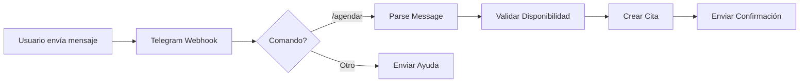

# 🤖 Configuración de N8N y Bot de Telegram

## 📋 Tabla de Contenidos
1. [Configuración del Bot de Telegram](#1-configuración-del-bot-de-telegram)
2. [Acceso a N8N](#2-acceso-a-n8n)
3. [Importar Workflows](#3-importar-workflows)
4. [Configurar Credenciales](#4-configurar-credenciales)
5. [Flujos de Trabajo](#5-flujos-de-trabajo)
6. [Pruebas del Sistema](#6-pruebas-del-sistema)

---

## 1. Configuración del Bot de Telegram

### Paso 1: Crear el Bot

1. **Abrir Telegram** y buscar `@BotFather`

2. **Crear nuevo bot**:
   ```
   /newbot
   ```

3. **Configurar nombre y username**:
   - Nombre: `Citas Médicas Bot` (o el que prefieras)
   - Username: `citas_medicas_123_bot` (debe terminar en 'bot' y ser único)

4. **Guardar el token**:
   ```
   5894732849:AAFfQKLMPoDWGaVnTRkO_8gHtY3vH4mXXXX
   ```

### Paso 2: Configurar Comandos del Bot

Enviar a @BotFather:
```
/setcommands
```

Luego pegar estos comandos:
```
start - Iniciar conversación con el bot
agendar - Agendar nueva cita médica
verificar - Verificar estado de cita
cancelar - Cancelar una cita existente
mis_citas - Ver todas mis citas
ayuda - Mostrar menú de ayuda
```

### Paso 3: Configurar Descripción

```
/setdescription
```

Descripción:
```
🏥 Bot de Gestión de Citas Médicas

Puedo ayudarte a:
• Agendar citas médicas
• Verificar el estado de tus citas
• Cancelar citas
• Recibir recordatorios

Envía /start para comenzar
```

---

## 2. Acceso a N8N

### Acceder al Panel de N8N

1. **Abrir navegador**: http://localhost:5678

2. **Credenciales por defecto**:
   - Usuario: `admin`
   - Password: `n8n_admin_123`

3. **Primer acceso**:
   - Crear cuenta si es necesario
   - Configurar zona horaria: America/Mexico_City

---

## 3. Importar Workflows

### Workflow Principal: Bot de Telegram

```json
{
  "name": "Telegram Bot - Citas Médicas",
  "nodes": [
    {
      "parameters": {
        "httpMethod": "POST",
        "path": "telegram-webhook",
        "responseMode": "responseNode",
        "options": {}
      },
      "id": "webhook-telegram",
      "name": "Telegram Webhook",
      "type": "n8n-nodes-base.webhook",
      "typeVersion": 1,
      "position": [250, 300]
    },
    {
      "parameters": {
        "conditions": {
          "string": [
            {
              "value1": "={{$json[\"message\"][\"text\"]}}",
              "operation": "startsWith",
              "value2": "/agendar"
            }
          ]
        }
      },
      "id": "router-commands",
      "name": "Command Router",
      "type": "n8n-nodes-base.switch",
      "typeVersion": 1,
      "position": [450, 300]
    },
    {
      "parameters": {
        "method": "POST",
        "url": "http://api-gateway:3000/api/appointments",
        "authentication": "genericCredentialType",
        "genericAuthType": "httpHeaderAuth",
        "sendBody": true,
        "bodyParameters": {
          "parameters": [
            {
              "name": "patient_id",
              "value": "={{$json[\"message\"][\"from\"][\"id\"]}}"
            },
            {
              "name": "doctor_id",
              "value": "={{$node[\"Extract Doctor\"].json[\"doctor_id\"]}}"
            },
            {
              "name": "appointment_date",
              "value": "={{$node[\"Parse Date\"].json[\"date\"]}}"
            },
            {
              "name": "appointment_time",
              "value": "={{$node[\"Parse Time\"].json[\"time\"]}}"
            }
          ]
        },
        "options": {}
      },
      "id": "create-appointment",
      "name": "Create Appointment",
      "type": "n8n-nodes-base.httpRequest",
      "typeVersion": 3,
      "position": [850, 200]
    },
    {
      "parameters": {
        "authentication": "oAuth2",
        "text": "✅ Cita agendada exitosamente!\n\n📅 Fecha: {{$node[\"Parse Date\"].json[\"formatted_date\"]}}\n⏰ Hora: {{$node[\"Parse Time\"].json[\"formatted_time\"]}}\n👨‍⚕️ Doctor: {{$node[\"Extract Doctor\"].json[\"doctor_name\"]}}\n\nID de cita: {{$node[\"Create Appointment\"].json[\"id\"]}}\n\nTe enviaremos un recordatorio 24 horas antes.",
        "chatId": "={{$json[\"message\"][\"chat\"][\"id\"]}}"
      },
      "id": "send-confirmation",
      "name": "Send Confirmation",
      "type": "n8n-nodes-base.telegram",
      "typeVersion": 1,
      "position": [1050, 200]
    },
    {
      "parameters": {
        "functionCode": "// Parse natural language date/time\nconst message = $input.item.json.message.text;\nconst patterns = {\n  agendar: /agendar\\s+cita\\s+(?:con\\s+)?(.+?)\\s+(?:para|el)\\s+(.+?)\\s+(?:a las|a)\\s+(.+)/i,\n  verificar: /verificar\\s+cita\\s+(.+)/i,\n  cancelar: /cancelar\\s+cita\\s+(.+)/i\n};\n\nlet result = {};\n\nif (message.startsWith('/agendar')) {\n  const match = message.match(patterns.agendar);\n  if (match) {\n    result = {\n      command: 'agendar',\n      doctor: match[1],\n      date: match[2],\n      time: match[3]\n    };\n  }\n} else if (message.startsWith('/verificar')) {\n  const match = message.match(patterns.verificar);\n  if (match) {\n    result = {\n      command: 'verificar',\n      appointment_id: match[1]\n    };\n  }\n} else if (message.startsWith('/cancelar')) {\n  const match = message.match(patterns.cancelar);\n  if (match) {\n    result = {\n      command: 'cancelar',\n      appointment_id: match[1]\n    };\n  }\n}\n\nreturn result;"
      },
      "id": "parse-message",
      "name": "Parse Message",
      "type": "n8n-nodes-base.code",
      "typeVersion": 2,
      "position": [650, 300]
    },
    {
      "parameters": {
        "authentication": "oAuth2",
        "text": "❌ No pude entender tu mensaje.\n\nUsa el formato:\n`/agendar cita con Dr. López para mañana a las 10:00`\n\nComandos disponibles:\n/agendar - Agendar nueva cita\n/verificar - Verificar cita\n/cancelar - Cancelar cita\n/mis_citas - Ver todas tus citas\n/ayuda - Ver esta ayuda",
        "chatId": "={{$json[\"message\"][\"chat\"][\"id\"]}}"
      },
      "id": "send-error",
      "name": "Send Error",
      "type": "n8n-nodes-base.telegram",
      "typeVersion": 1,
      "position": [650, 500]
    }
  ],
  "connections": {
    "Telegram Webhook": {
      "main": [[{"node": "Command Router", "type": "main", "index": 0}]]
    },
    "Command Router": {
      "main": [
        [{"node": "Parse Message", "type": "main", "index": 0}],
        [{"node": "Send Error", "type": "main", "index": 0}]
      ]
    },
    "Parse Message": {
      "main": [[{"node": "Create Appointment", "type": "main", "index": 0}]]
    },
    "Create Appointment": {
      "main": [[{"node": "Send Confirmation", "type": "main", "index": 0}]]
    }
  },
  "settings": {
    "executionOrder": "v1"
  },
  "staticData": null,
  "meta": {
    "instanceId": "telegram-bot-citas"
  },
  "tags": []
}
```

### Importar el Workflow

1. **En N8N, click en** "+" → "Import from File" o "Import from JSON"
2. **Pegar el JSON** del workflow
3. **Click en** "Import"
4. **Guardar workflow**

---

## 4. Configurar Credenciales

### Telegram Bot API

1. **En N8N**, ir a Settings → Credentials
2. **Click en** "Add Credential"
3. **Buscar** "Telegram API"
4. **Configurar**:
   ```
   Access Token: [Tu token del bot]
   ```
5. **Test** y **Save**

### API Gateway Authentication

1. **Add Credential** → "Header Auth"
2. **Configurar**:
   ```
   Header Name: Authorization
   Header Value: Bearer your_jwt_token
   ```

---

## 5. Flujos de Trabajo

### Flujo 1: Agendar Cita



**Ejemplo de conversación**:
```
Usuario: /agendar cita con Dr. López para mañana a las 10:00
Bot: ✅ Cita agendada exitosamente!
     📅 Fecha: 20/11/2024
     ⏰ Hora: 10:00
     👨‍⚕️ Doctor: Dr. López
     
     ID de cita: ABC123
```

### Flujo 2: Verificar Cita

```javascript
// Nodo de verificación
const appointmentId = $json["parsed"]["appointment_id"];

// Llamar al API
const response = await $http.request({
  method: 'GET',
  url: `http://api-gateway:3000/api/appointments/${appointmentId}`,
  headers: {
    'Authorization': 'Bearer ' + $credentials.jwt
  }
});

// Formatear respuesta
return {
  status: response.data.status,
  date: response.data.appointment_date,
  time: response.data.appointment_time,
  doctor: response.data.doctor_name
};
```

### Flujo 3: Cancelar Cita

```javascript
// Nodo de cancelación
const appointmentId = $json["parsed"]["appointment_id"];
const reason = $json["parsed"]["reason"] || "Solicitado por usuario";

// Llamar al API
const response = await $http.request({
  method: 'DELETE',
  url: `http://api-gateway:3000/api/appointments/${appointmentId}`,
  params: {
    reason: reason
  },
  headers: {
    'Authorization': 'Bearer ' + $credentials.jwt
  }
});

return {
  success: true,
  message: "Cita cancelada exitosamente"
};
```

### Flujo 4: Recordatorio Automático

```json
{
  "name": "Appointment Reminder",
  "nodes": [
    {
      "parameters": {
        "rule": {
          "interval": [
            {
              "field": "hours",
              "hoursInterval": 1
            }
          ]
        }
      },
      "id": "cron-trigger",
      "name": "Every Hour",
      "type": "n8n-nodes-base.cron",
      "typeVersion": 1,
      "position": [250, 300]
    },
    {
      "parameters": {
        "method": "GET",
        "url": "http://api-gateway:3000/api/appointments",
        "queryParameters": {
          "parameters": [
            {
              "name": "status",
              "value": "confirmed"
            },
            {
              "name": "date",
              "value": "={{$today.plus(1, 'day').format('YYYY-MM-DD')}}"
            }
          ]
        }
      },
      "id": "get-tomorrow-appointments",
      "name": "Get Tomorrow Appointments",
      "type": "n8n-nodes-base.httpRequest",
      "typeVersion": 3,
      "position": [450, 300]
    },
    {
      "parameters": {
        "authentication": "oAuth2",
        "text": "🔔 Recordatorio de Cita\n\n📅 Fecha: {{$json[\"appointment_date\"]}}\n⏰ Hora: {{$json[\"appointment_time\"]}}\n👨‍⚕️ Doctor: {{$json[\"doctor_name\"]}}\n\nPor favor confirma tu asistencia respondiendo:\n✅ CONFIRMAR\n❌ CANCELAR",
        "chatId": "={{$json[\"patient_telegram_id\"]}}"
      },
      "id": "send-reminder",
      "name": "Send Reminder",
      "type": "n8n-nodes-base.telegram",
      "typeVersion": 1,
      "position": [650, 300]
    }
  ]
}
```

---

## 6. Pruebas del Sistema

### Test 1: Agendar Cita Simple

1. **Abrir Telegram**
2. **Buscar tu bot**: @citas_medicas_123_bot
3. **Enviar**:
   ```
   /start
   /agendar cita con Dr. López para mañana a las 10:00
   ```
4. **Verificar** respuesta de confirmación

### Test 2: Verificar Cita

```
/verificar ABC123
```

**Respuesta esperada**:
```
📋 Información de tu cita:
Estado: Confirmada
Fecha: 20/11/2024
Hora: 10:00
Doctor: Dr. López
```

### Test 3: Cancelar Cita

```
/cancelar ABC123
```

**Respuesta esperada**:
```
❌ Cita cancelada exitosamente
ID: ABC123
```

### Test 4: Manejo de Errores

```
/agendar cita mal formateada
```

**Respuesta esperada**:
```
❌ No pude entender tu mensaje.

Usa el formato:
/agendar cita con Dr. López para mañana a las 10:00
```

---

## 🔧 Troubleshooting

### Problema: Webhook no recibe mensajes

**Solución**:
1. Verificar token del bot
2. Configurar webhook manualmente:
```bash
curl -X POST https://api.telegram.org/bot<TOKEN>/setWebhook \
  -H "Content-Type: application/json" \
  -d '{"url": "http://tu-servidor:5678/webhook/telegram-webhook"}'
```

### Problema: Error de autenticación en API

**Solución**:
1. Verificar JWT token en credenciales
2. Verificar que el API Gateway esté corriendo
3. Revisar logs: `docker-compose logs api-gateway`

### Problema: N8N no guarda workflows

**Solución**:
1. Verificar permisos del volumen
2. Reiniciar N8N: `docker-compose restart n8n`

---

## 📊 Monitoreo

### Ver Logs de N8N

```bash
docker-compose logs -f n8n
```

### Ver Ejecuciones

1. En N8N, ir a "Executions"
2. Ver historial de ejecuciones
3. Click en cualquier ejecución para ver detalles

### Métricas

N8N Dashboard muestra:
- Ejecuciones exitosas/fallidas
- Tiempo de respuesta promedio
- Workflows más utilizados

---

## 🎓 Ejercicios para Estudiantes

### Ejercicio 1: Agregar comando /mis_citas

Crear un workflow que:
1. Reciba comando `/mis_citas`
2. Consulte todas las citas del usuario
3. Formatee y envíe lista de citas

### Ejercicio 2: Implementar confirmación por voz

Agregar soporte para:
1. Recibir notas de voz
2. Transcribir usando Whisper API
3. Procesar comando de voz

### Ejercicio 3: Notificaciones inteligentes

Implementar:
1. Recordatorio 48 horas antes
2. Recordatorio 24 horas antes
3. Recordatorio 2 horas antes
4. Confirmación post-cita

---

## 📚 Recursos Adicionales

- [Documentación N8N](https://docs.n8n.io)
- [Telegram Bot API](https://core.telegram.org/bots/api)
- [Webhooks Best Practices](https://docs.n8n.io/integrations/webhooks/)

---

## ✅ Checklist Final

- [ ] Bot de Telegram creado
- [ ] Token guardado en .env
- [ ] N8N accesible en http://localhost:5678
- [ ] Workflow importado
- [ ] Credenciales configuradas
- [ ] Webhook activo
- [ ] Pruebas exitosas
- [ ] Logs sin errores
